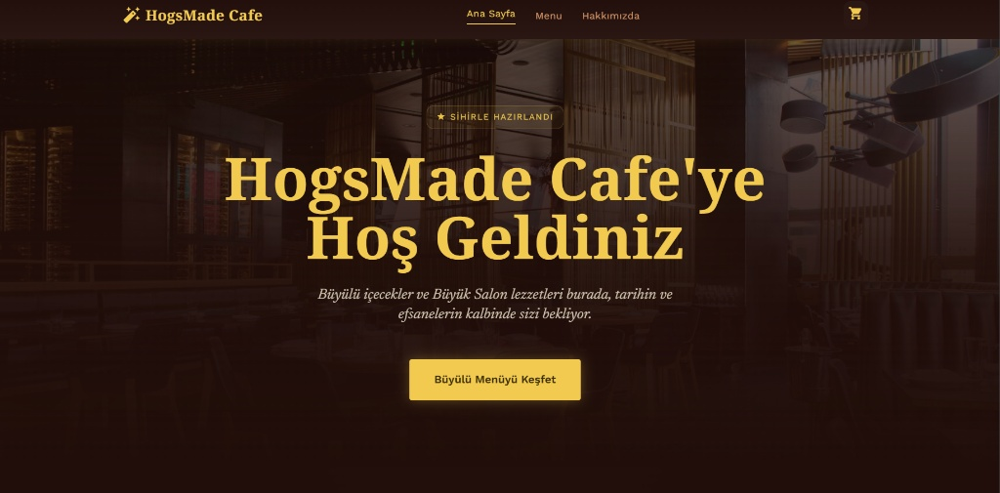
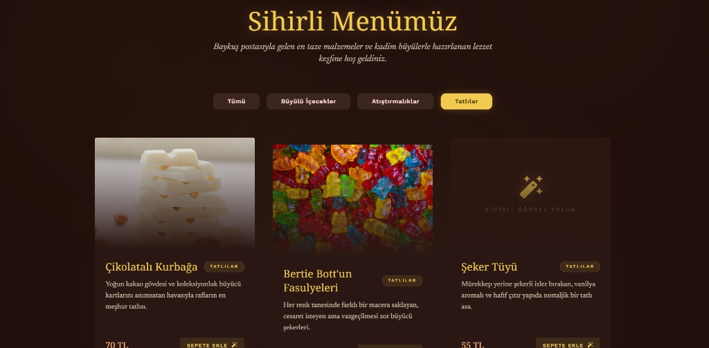
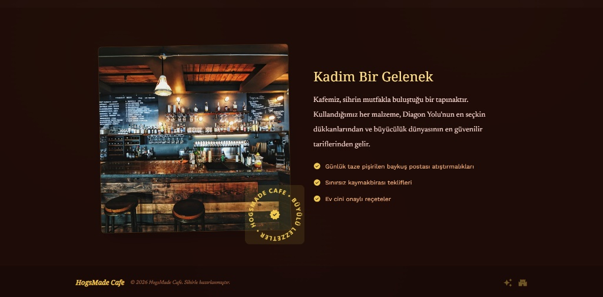
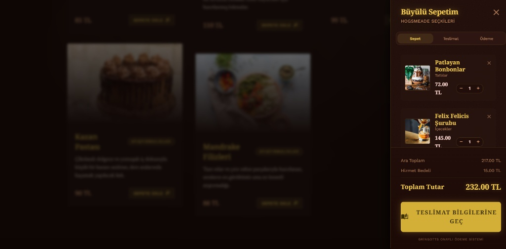
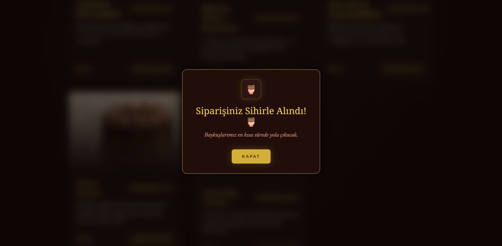
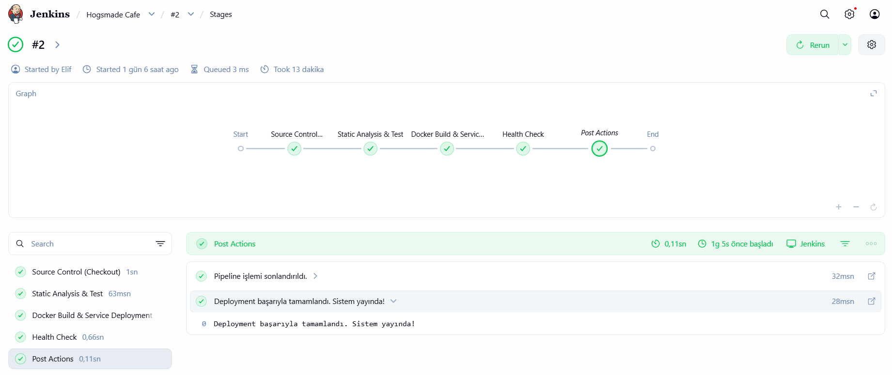
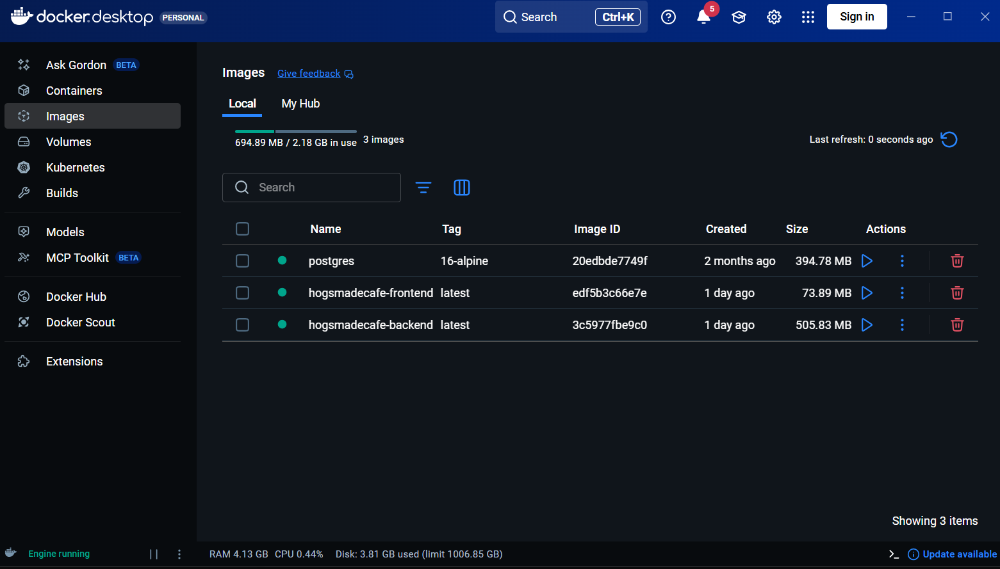
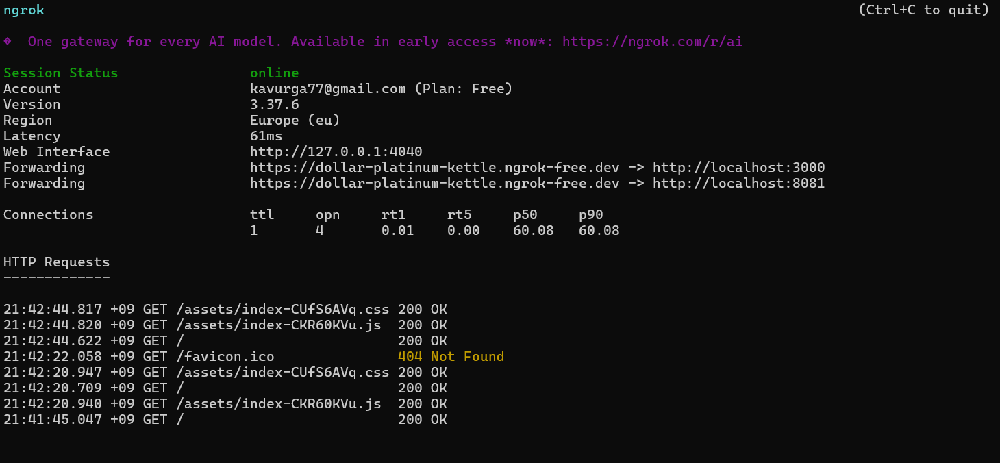

# HogsMade Cafe

HogsMade Cafe, Harry Potter evreninden ilham alan temasıyla geliştirilen full-stack bir cafe sipariş ve yönetim uygulamasıdır. Bu ders projesinde asıl amaç yalnızca uygulamayı çalıştırmak değil, aynı zamanda `Jenkins + Docker + ngrok` araçlarını birlikte kullanarak basit bir CI/CD ve dış erişim senaryosu göstermektir.

## Proje Amacı

Bu proje, yazılım geliştirme ile DevOps süreçlerini aynı örnek üzerinde birleştirmek için hazırlanmıştır.

- `Jenkins` ile GitHub'dan kod çekme ve pipeline akışını yönetme
- `Docker Compose` ile frontend, backend ve PostgreSQL servislerini birlikte ayağa kaldırma
- `ngrok` ile lokal ortamda çalışan servislere internet üzerinden erişim sağlama

Bu sayede proje, ders kapsamında hem uygulama geliştirme hem de dağıtım mantığını tek yapıda göstermektedir.

## Proje Özeti

Uygulama temel olarak şu akışları destekler:

- Menü ürünlerini listeleme
- Ürün detaylarını inceleme
- Sepete ürün ekleme ve sepet yönetimi
- Sipariş oluşturma
- Docker ile çoklu servis çalıştırma
- Jenkins pipeline ile otomatik dağıtım akışı gösterme
- ngrok ile canlı demo bağlantısı üretme

## Sistem Mimarisi

Kök dizindeki [`compose.yaml`](compose.yaml) dosyası üç ana servisi birlikte ayağa kaldırır:

- `frontend`: dışarıya `3000` portundan açılır
- `backend`: `8081` portundan servis edilir
- `postgres`: `5432` portunda çalışır

Frontend imajı kök dizindeki [`Dockerfile`](Dockerfile) ile build edilir ve Nginx üzerinden servis edilir. Backend servisi ise [`hogsmadecafe`](hogsmadecafe) klasöründen build alınarak PostgreSQL'e bağlanır.

## Jenkins Pipeline

Bu projede Jenkins tarafında kullanılan pipeline mantığı, GitHub'dan kodun çekilmesi, Docker Compose ile servislerin ayağa kaldırılması ve sonrasında temel sağlık kontrolünün yapılması üzerine kuruludur.

```groovy
pipeline {
    agent any

    environment {
        PROJECT_NAME = "hogsmade-cafe"
        COMPOSE_FILE = "compose.yaml"
    }

    stages {
        stage('Source Control (Checkout)') {
            steps {
                echo 'Kodlar GitHub üzerinden çekiliyor...'
                git branch: 'main', url: 'https://github.com/elifkavurga/Hogsmade-Cafe.git'
            }
        }

        stage('Static Analysis & Test') {
            steps {
                echo 'Birim testleri ve statik kod analizi başlatılıyor...'
            }
        }

        stage('Docker Build & Service Deployment') {
            steps {
                echo 'Docker imajları oluşturuluyor ve servisler ayağa kaldırılıyor...'
                bat "docker-compose -f ${COMPOSE_FILE} up --build -d --remove-orphans"
            }
        }

        stage('Health Check') {
            steps {
                echo 'Sistem sağlık kontrolü yapılıyor...'
                bat 'docker ps'
            }
        }
    }

    post {
        success {
            echo 'Deployment başarıyla tamamlandı. Sistem yayında!'
        }
        failure {
            echo 'Hata oluştu! Loglar incelenmeli.'
            bat 'docker-compose logs --tail=50'
        }
        always {
            echo 'Pipeline işlemi sonlandırıldı.'
        }
    }
}
```

1. Jenkins, projeyi GitHub reposundan çeker.
2. Docker Compose ile tüm servisleri build edip ayağa kaldırır.
3. Çalışan container'lar kontrol edilir.
4. ngrok ile lokal servisler dış dünyaya açılır.

## ngrok ile Dış Erişim

Projede ngrok, lokal ortamda çalışan frontend ve backend servislerini internet üzerinden erişilebilir hale getirmek için kullanılmıştır. Tünel ayarları [`Hogsmade Deploy/config.yml`](Hogsmade%20Deploy/config.yml) dosyasında tanımlanmıştır.

Bu dosyada iki temel tünel bulunur:

- `hogs-front` -> `3000` portundaki frontend servisi
- `hogs-back` -> `8081` portundaki backend servisi

### ngrok.exe Üzerinden Başlatma

```powershell
ngrok start --all --config="C:\Users\PC\Desktop\Hogsmade-Cafe\Hogsmade Deploy\config.yml"
```

Eğer `ngrok` komutu doğrudan çalışmıyorsa, `ngrok.exe` dosyasının bulunduğu klasöre gidip şu şekilde de başlatabilirsiniz:

```powershell
.\ngrok.exe start --all --config="C:\Users\PC\Desktop\Hogsmade-Cafe\Hogsmade Deploy\config.yml"
```

Bu komutun yaptığı iş:

- `--all`: config dosyasındaki tüm tünelleri aynı anda başlatır
- `--config=...`: kullanılacak `config.yml` dosyasını belirtir

Böylece aynı anda hem frontend hem backend için herkese açık ngrok adresleri oluşur ve proje lokal makinede çalışsa bile dışarıdan erişilebilir hale gelir.

## Projeyi Çalıştırma

Proje ana dizininde:

```bash
docker compose up --build -d
```

Servisleri kontrol etmek için:

```bash
docker ps
```

Servisleri durdurmak için:

```bash
docker compose down
```

## Uygulama Görselleri

### Arayüz Ekranları

<p align="center">
  
  
  
</p>

<p align="center">
  
  
</p>

Bu ekran görüntüleri uygulamanın tema yaklaşımını, menü akışını ve kullanıcı tarafındaki deneyimi gösterir.

### DevOps ve Yayınlama Görselleri

<p align="center">
  
  
  
</p>

Bu bölümde Jenkins pipeline akışı, Docker üzerinde çalışan servisler ve ngrok ile dış erişim örneği yer alır.

